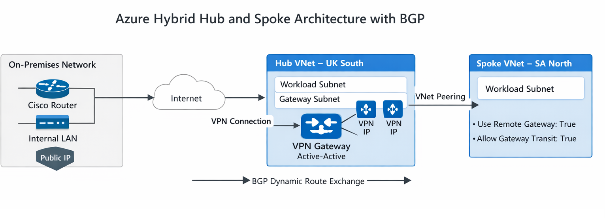

# Azure Hub and Spoke Hybrid Networking with Terraform

## Network Architecture Diagram

---

## Project Overview

This project demonstrates a complete Azure-side hybrid networking deployment using Terraform.

The objective was straightforward and intentional:

Design and deploy a clean hub-and-spoke architecture in Azure, integrate it with an on-prem environment using Site-to-Site VPN with BGP, and structure everything properly using Infrastructure as Code.

This repository focuses on the Azure side implementation.  
The on-prem configuration has been implemented on a separate repo.

---

## What This Deployment Builds

The Terraform configuration provisions:

- One Resource Group
- Two VNets in separate regions:
  - UK South (Hub)
  - South Africa North (Spoke)
- Workload subnets
- GatewaySubnet (required for VPN Gateway)
- Bidirectional VNet Peering
- Azure VPN Gateway (Active-Active)
- BGP-enabled Site-to-Site VPN
- Two Local Network Gateways
- Two VPN connections for high availability
- Structured outputs for validation and reuse

This is not just basic resource deployment. It is full hybrid connectivity with dynamic routing.

---

## Architectural Design

### Hub (UK South)

- Workload subnet
- GatewaySubnet
- Azure VPN Gateway (Active-Active)
- BGP enabled
- Gateway transit enabled

### Spoke (South Africa North)

- Workload subnet
- Uses remote gateway from hub
- Peered to hub

### Connectivity Design

- Route-based VPN
- BGP over APIPA addressing
- Active-Active gateway configuration
- Dynamic route exchange between Azure and on-prem

---

## Why BGP Was Used

BGP keeps routing dynamic and scalable.

Instead of maintaining static routes manually, Azure and on-prem exchange routes automatically. This reflects how enterprise hybrid environments are typically implemented.

---

## Critical Configuration That Must Match (Azure and On-Prem)

For the tunnel and BGP to function correctly, the following values must align on both sides:

1. Pre-shared key (PSK)
2. IKE policy (encryption, integrity, DH group)
3. IPsec policy (encryption, integrity, PFS group)
4. Tunnel interface APIPA addresses (/30 pairing must match)
5. Azure ASN and On-prem ASN
6. BGP neighbor IP addresses must match Azure BGP peer IPs

If any of the above do not match exactly, Phase 1 may succeed while BGP fails to establish.

---

## Required Inputs Before Deployment

You must supply:

- On-prem public IP addresses
- VPN shared key
- Optional on-prem internal prefixes
- VM password (if deploying validation VMs)

These values are intentionally externalized and not hardcoded.

---

## Variables Configuration

Create:

    variables.tf

Add:

    variable "shared_key" {
      type      = string
      sensitive = true
    }

    variable "onprem_primary_public_ip" {
      type = string
    }

    variable "onprem_secondary_public_ip" {
      type = string
    }

    variable "vm_password" {
      type      = string
      sensitive = true
    }

Then create:

    terraform.tfvars

Example:

    shared_key = "ReplaceWithStrongPSK"
    onprem_primary_public_ip   = "ReplaceWithPrimaryPublicIP"
    onprem_secondary_public_ip = "ReplaceWithSecondaryPublicIP"
    vm_password = "ReplaceWithStrongPassword"

Do not commit terraform.tfvars.

---

## Deployment Steps

From the root directory:

    terraform init
    terraform plan
    terraform apply

VPN gateway creation can take 20 to 45 minutes.

If Azure API calls behave inconsistently:

    terraform apply -parallelism=1

---

## Optional Validation (VM Ping Test)

This repository does not automatically deploy validation VMs by default.

To test connectivity:

1. Deploy one VM inside the UK VNet workload subnet (subnet-1)
2. Deploy one VM inside the SA VNet workload subnet (subnet-1)
3. Ensure ICMP is allowed if NSGs are configured
4. Ping/trace between private IP addresses within Azure and across on-prem

For BGP validation:

- Check effective routes on Azure NIC
- Confirm BGP summary on the on-prem device
- Ensure Azure VPN gateway BGP peers show Connected

---

## Terraform Structure Note

Terraform compiles all .tf files in the directory and builds a dependency graph automatically. File order does not control resource creation order.

However, for clarity and learning purposes, this project is structured in logical build sequence:

1. Provider configuration (main.tf)
2. Resource group (resourcegroup.tf)
3. VNets and subnets (virtual_networks.tf)
4. Peering (vnet_peering.tf)
5. Gateway public IPs (gw_ip config.tf)
6. VPN gateway (vnet_gateway.tf)
7. Local network gateways (local_network_gateway.tf)
8. VPN connections (vpn_connection.tf)
9. Outputs (outputs.tf)

This structure reflects the architectural flow of the deployment.

---

## Git Hygiene

The following must never be committed:

    *.tfstate
    *.tfstate.backup
    *.tfstate.lock.info
    .terraform/
    terraform.tfvars

The file `.terraform.lock.hcl` should remain committed to lock provider versions.

---

## Cleanup

To remove all deployed resources:

    terraform destroy

---

## Closing Notes

This project demonstrates:

- Hub-and-spoke hybrid architecture
- Active-Active VPN gateway
- BGP-based dynamic routing
- Clean Terraform structuring
- Proper separation of configuration and secrets

It is designed to reflect how hybrid connectivity is implemented in real-world environments, not just as a lab setup.

---

## 📧 Contact

- **Author**: Patrick Ukponu
- Network Engineer|CCNP Enterprise|Cyber Security Specialist|
- **LinkedIn**: https://www.linkedin.com/in/patrick-u-78a001176/
- **Email**: pat.ukponu@gmail.com
